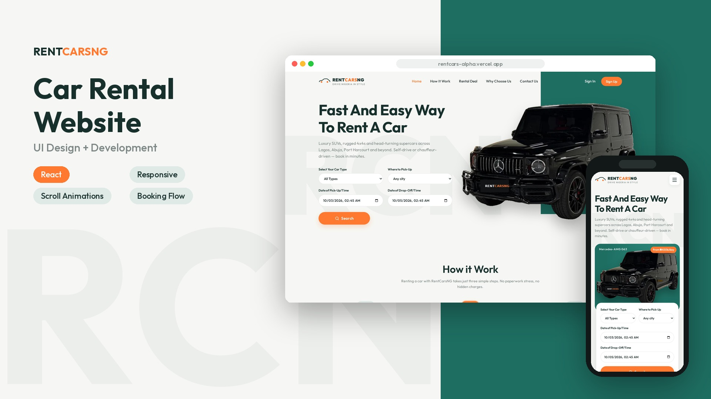
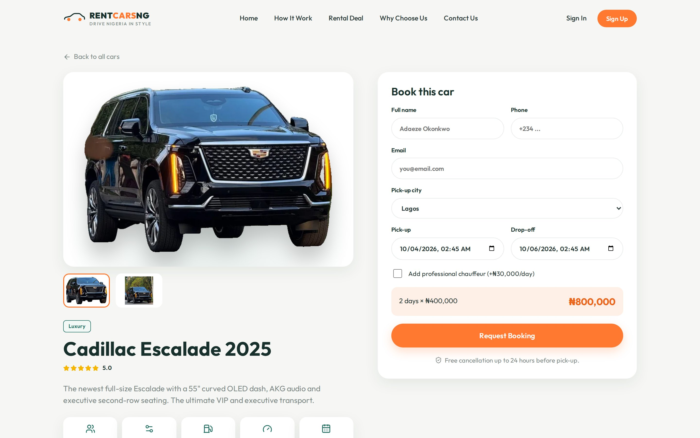
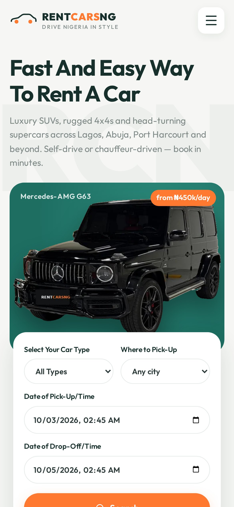

# RentCarsNG

A responsive car rental website concept for the Nigerian market, built with React + Vite.

**Live demo:** https://rentcars-alpha.vercel.app



| Fleet & booking | Mobile |
| --- | --- |
|  |  |

## Features
- 7 pages with client-side routing
- Fleet filtering by type, brand and price
- Car detail pages with a booking form and live ₦ price calculation (+ chauffeur option)
- Branch finder with embedded maps for five cities
- Scroll-triggered reveals, parallax, count-up stats and a progress bar (respects reduced motion)
- Background-removed car imagery for a clean catalogue look

## Pages
- `/` Home (hero search, how it works, top rated cars, services, branches, testimonials, off-road fleet, blog)
- `/how-it-works`
- `/rental-deals` — full fleet with category / brand / price filters
- `/cars/:id` — car details with booking form & price calculator
- `/why-choose-us` — reasons, stats, FAQ
- `/contact` — contact form & branch map
- `/sign-in`, `/sign-up`

## Images
Car photos live in `public/cars/raw/`; background-removed versions (made with [rembg](https://github.com/danielgatis/rembg), `isnet-general-use` model) are in `public/cars/cutout/`. Fleet data is in `src/data/cars.js`.

## Develop
```bash
npm install
npm run dev
npm run build
```

Forms (booking, contact, sign in/up, newsletter) are front-end only for now — they show a confirmation but do not send data to a backend yet.
